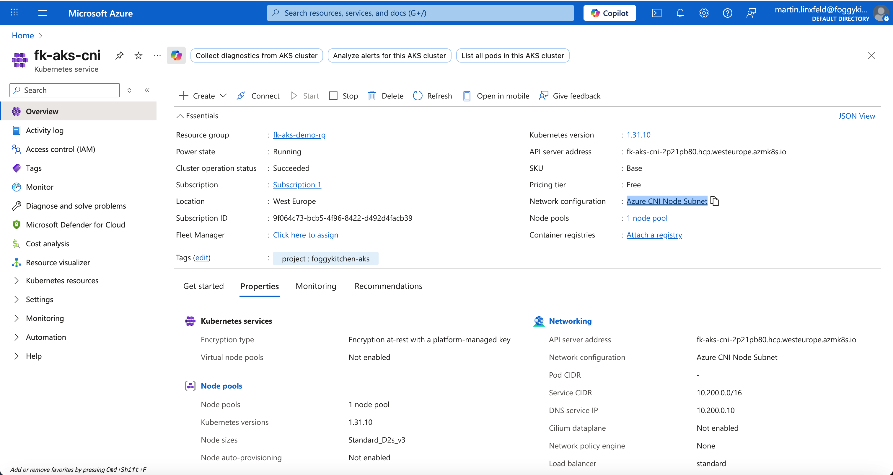

# Lesson 2: AKS Cluster with Azure CNI (Advanced Networking)

In this example, we’ll deploy an AKS cluster using **Azure CNI** networking instead of Kubenet.
Pods will receive IP addresses directly from the Virtual Network, enabling full integration with Azure services.

---

## 🧭 Architecture Overview

This scenario builds upon Lesson 1 and introduces:
- A pre-created Virtual Network and Subnet for AKS nodes and pods.
- An AKS Cluster configured with `network_plugin = "azure"`.
- Optional NSG rules for controlled traffic flow.

> Using Azure CNI allows pod-to-VM communication without NAT — useful for enterprise networking and hybrid connectivity scenarios.

---

## 🚀 Deployment Steps

```bash
tofu init
tofu plan
tofu apply
```

Fetch credentials and verify cluster readiness:

```bash
az aks get-credentials -g foggykitchen-rg -n foggykitchen-aks
kubectl get nodes
kubectl get pods -A -o wide
```

Observe how pods now receive **IP addresses from the VNet subnet**.

---

## 🖼️ Azure Portal View



You’ll see the cluster’s Virtual Network integration under **Networking → Network configuration**.

---

## 🧹 Cleanup

```bash
tofu destroy
```

---

### ✅ Summary

This example shows how to:
- Use **Azure CNI** for full IP-level connectivity between pods and Azure resources.
- Plan subnet CIDR blocks carefully for large clusters.
- Compare Kubenet (Lesson 1) vs Azure CNI (Lesson 2).

Azure CNI mode is equivalent to the **Enhanced (VCN-Native)** cluster mode in OCI OKE.

---

## 🌐 Learn More

Visit [FoggyKitchen.com](https://foggykitchen.com/) for hybrid cloud examples, architecture diagrams, and in-depth learning.

---

## 🪪 License

Licensed under the Universal Permissive License (UPL), Version 1.0.  
See [LICENSE](../../LICENSE) for more details.
