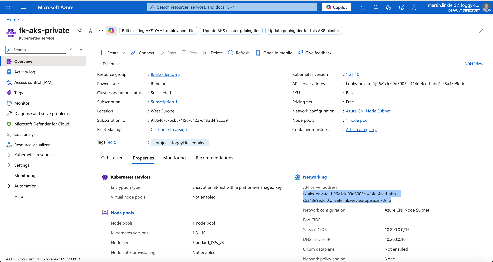

# Lesson 3: Private AKS Cluster (Private Link Enabled)

In this example, we’ll deploy an **AKS cluster with a private API server endpoint** using Azure Private Link.
The cluster’s control plane is accessible **only inside your Virtual Network**.

---

## 🧭 Architecture Overview

This configuration includes:
- A Resource Group and Virtual Network for AKS.
- A managed private endpoint for the AKS API server.
- A system-managed Private DNS Zone (`privatelink.<region>.azmk8s.io`).
- A private-only control plane (no public API).

> With `private_cluster_enabled = true`, the cluster control plane is fully isolated — you can’t reach it from the Internet.

---

## 🚀 Deployment Steps

Apply the Terraform configuration:

```bash
tofu init
tofu plan
tofu apply
```

Terraform will provision the cluster successfully, but note:

> ❗ You won’t be able to connect to the cluster with `kubectl` unless you are inside the same VNet (via VPN, Bastion, or Jump Host).

If you have a Bastion or VM in that network:

```bash
az aks get-credentials -g foggykitchen-rg -n foggykitchen-aks
kubectl get nodes
```

---

## 🖼️ Azure Portal View



You’ll notice a **Private endpoint connection** and **Private DNS Zone** linked to your VNet.

---

## 🧹 Cleanup

```bash
tofu destroy
```

---

### ✅ Summary

This example demonstrates:
- How to enable **private cluster mode** in AKS.
- How the API server becomes reachable only via **Private Link**.
- Why private clusters require **DNS and connectivity setup** before you can use `kubectl`.

This setup is the Azure equivalent of a **Private OKE Cluster** with restricted API access inside a VCN.

---

## 🌐 Learn More

Visit [FoggyKitchen.com](https://foggykitchen.com/) for hybrid cloud examples, architecture diagrams, and in-depth learning.

---

## 🪪 License

Licensed under the Universal Permissive License (UPL), Version 1.0.  
See [LICENSE](../../LICENSE) for more details.
