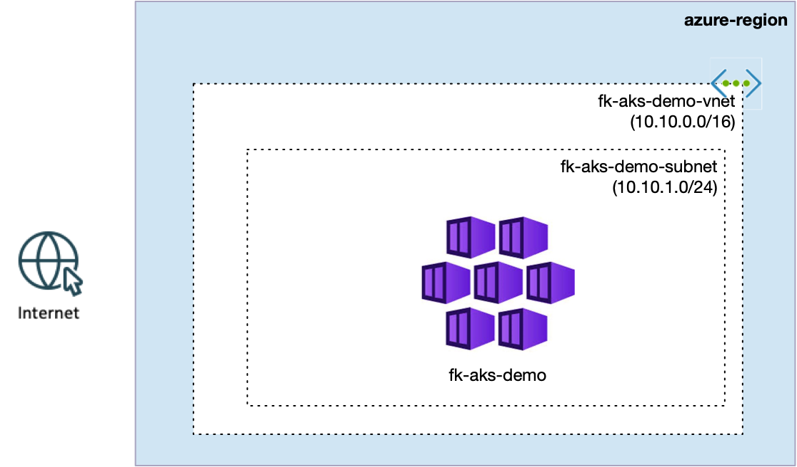
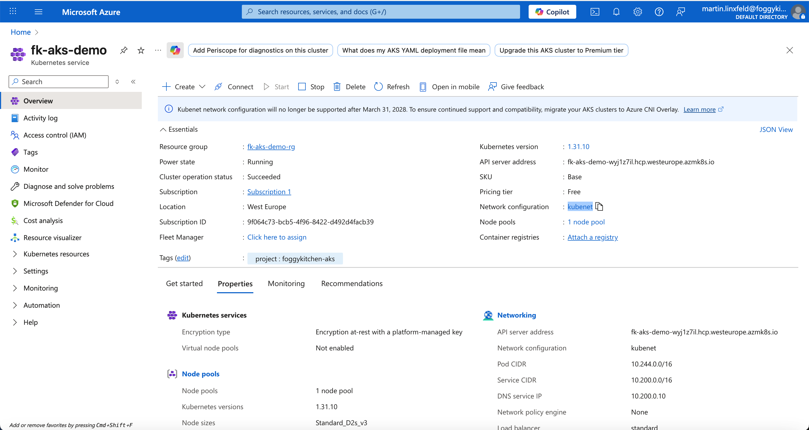

# Lesson 01: Basic AKS with Kubenet

In this first example, we deploy a minimal **Azure Kubernetes Service (AKS)** cluster using **Kubenet** networking.
The cluster, Resource Group, and basic networking are created through the reusable **FoggyKitchen AKS module**.

This lesson is intentionally small. It is the baseline for comparing Kubenet with the Azure CNI setup used in Lesson 02.

Related blog post:
[Kubenet vs Azure CNI in AKS - What's the Difference (with Terraform examples)](https://foggykitchen.com/2025/11/14/aks-kubenet-vs-azure-cni/)

---

## Architecture Overview



This deployment creates:
- A new **Resource Group**.
- A basic AKS VNet and subnet created automatically by `terraform-az-fk-aks`.
- An **AKS cluster** using Kubenet networking.
- One default system node pool.

With `create_networking = true`, the AKS module creates:
- `fk-aks-demo-vnet` with address space `10.10.0.0/16`.
- `fk-aks-demo-subnet` with address prefix `10.10.1.0/24`.

Kubenet keeps pod networking separate from the VNet subnet. In the Azure Portal, the cluster appears with `kubenet` as its network configuration and a Pod CIDR assigned by AKS.

---

## Module Composition

The whole baseline environment is created by the FoggyKitchen AKS module:

```hcl
module "aks" {
  source = "../.."

  name                = "fk-aks-demo"
  create_rg           = true
  location            = var.location
  resource_group_name = var.resource_group_name

  create_networking = true
  network_plugin    = "kubenet"
}
```

The important settings are:
- `create_rg = true` creates the Resource Group inside the AKS module.
- `create_networking = true` creates the VNet and subnet inside the AKS module.
- `network_plugin = "kubenet"` selects Kubenet networking for this baseline cluster.

---

## Deployment Steps

Initialize and apply the OpenTofu configuration:

```bash
tofu init
tofu plan
tofu apply
```

After deployment, fetch AKS credentials:

```bash
az aks get-credentials \
  --resource-group <resource-group-name> \
  --name fk-aks-demo \
  --overwrite-existing
```

Verify the node pool:

```bash
kubectl get nodes
```

---

## Azure Portal View

After deployment, open the AKS cluster in the Azure Portal and inspect **Networking**.
You should see:
- Network configuration set to **kubenet**.
- A Pod CIDR assigned by AKS.
- One system node pool.



---

## Cleanup

To remove all resources created by this example:

```bash
tofu destroy
```

---

## Summary

This example demonstrates:
- How to deploy a basic AKS cluster with **Kubenet** using OpenTofu.
- How the AKS module can create both the Resource Group and basic networking.
- The baseline networking model used for comparison with Azure CNI in Lesson 02.

---

## Learn More

Visit [FoggyKitchen.com](https://foggykitchen.com/) for Azure, multicloud, and Terraform/OpenTofu learning resources.

---

## License

Licensed under the **Universal Permissive License (UPL), Version 1.0**.  
See [LICENSE](../../LICENSE) for more details.
