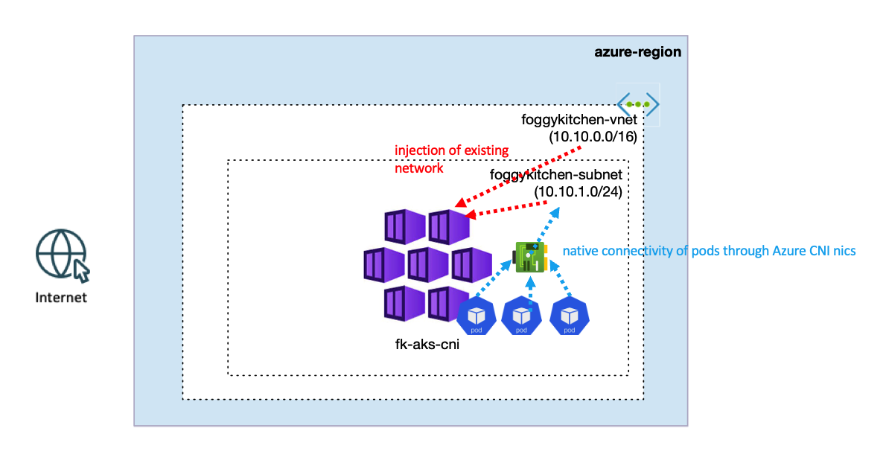
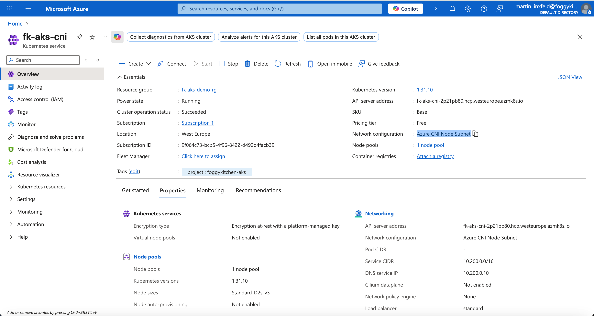

# Lesson 02: AKS with Azure CNI and Existing VNet

In this example, we deploy an **Azure Kubernetes Service (AKS)** cluster using **Azure CNI** networking with a dedicated Azure Virtual Network.
The network is created outside the AKS module with the reusable **FoggyKitchen VNet module**, and then injected into the reusable **FoggyKitchen AKS module** through `vnet_id` and `subnet_id`.

Azure CNI assigns pod IP addresses directly from the VNet subnet, which gives pods first-class connectivity with Azure networking.
This is the recommended model when AKS must integrate closely with existing Azure services, hub-and-spoke networks, or hybrid connectivity.

Related blog post:
[Kubenet vs Azure CNI in AKS - What's the Difference (with Terraform examples)](https://foggykitchen.com/2025/11/14/aks-kubenet-vs-azure-cni/)

---

## Architecture Overview



This deployment creates:
- A new **Resource Group**.
- A dedicated **Azure Virtual Network** using `terraform-az-fk-vnet`.
- One AKS subnet inside the VNet.
- An **AKS cluster** using `terraform-az-fk-aks`.
- Two system nodes attached to the AKS subnet.

The diagram highlights two important Azure CNI concepts:
- The VNet and subnet are external to the AKS module and are passed into it as existing network inputs.
- Pods get native VNet connectivity through Azure CNI network interfaces instead of using Kubenet pod routing.

The important difference from Lesson 01 is the networking model:
- Lesson 01 uses **Kubenet**.
- Lesson 02 uses **Azure CNI** with a VNet subnet passed into the AKS module.

---

## Module Composition

The VNet is created by the FoggyKitchen VNet module:

```hcl
module "vnet" {
  source = "github.com/mlinxfeld/terraform-az-fk-vnet"

  name                = "foggykitchen-vnet"
  location            = azurerm_resource_group.foggykitchen_rg.location
  resource_group_name = azurerm_resource_group.foggykitchen_rg.name

  address_space = ["10.10.0.0/16"]

  subnets = {
    foggykitchen-subnet = {
      address_prefixes = ["10.10.1.0/24"]
    }
  }
}
```

The AKS module consumes the VNet outputs. This is the network injection point shown in the architecture diagram:

```hcl
module "aks" {
  source              = "../.."
  name                = "fk-aks-cni"
  location            = azurerm_resource_group.foggykitchen_rg.location
  resource_group_name = azurerm_resource_group.foggykitchen_rg.name

  network_plugin = "azure"
  vnet_id        = module.vnet.vnet_id
  subnet_id      = module.vnet.subnet_ids["foggykitchen-subnet"]

  default_node_count   = 2
  default_node_vm_size = "Standard_D2s_v3"
}
```

---

## Deployment Steps

Initialize and apply the OpenTofu configuration:

```bash
tofu init
tofu plan
tofu apply
```

After deployment, fetch AKS credentials:

```bash
az aks get-credentials \
  --resource-group <resource-group-name> \
  --name fk-aks-cni \
  --overwrite-existing
```

Verify the nodes:

```bash
kubectl get nodes
```

Verify that pods receive IP addresses from the VNet subnet:

```bash
kubectl get pods -A -o wide
```

You should see pod IPs from the `10.10.1.0/24` subnet.

---

## Azure Portal View

After deployment, open the AKS cluster in the Azure Portal and inspect **Networking**.
You should see:
- Network plugin set to **Azure CNI**.
- The AKS cluster attached to the VNet created by the VNet module.
- Node and pod IPs allocated from the AKS subnet.



---

## Cleanup

To remove all resources created by this example:

```bash
tofu destroy
```

---

## Summary

This example demonstrates:
- How to deploy AKS with **Azure CNI** using OpenTofu.
- How to compose the **FoggyKitchen VNet** and **AKS** modules.
- How `vnet_id` and `subnet_id` inject external networking into AKS.
- How Azure CNI gives pods native VNet connectivity.
- Why subnet sizing matters when pods receive IP addresses directly from Azure networking.

Azure CNI mode is conceptually similar to VCN-native pod networking in OCI OKE.

---

## Learn More

Visit [FoggyKitchen.com](https://foggykitchen.com/) for Azure, multicloud, and Terraform/OpenTofu learning resources.

---

## License

Licensed under the **Universal Permissive License (UPL), Version 1.0**.  
See [LICENSE](../../LICENSE) for more details.
