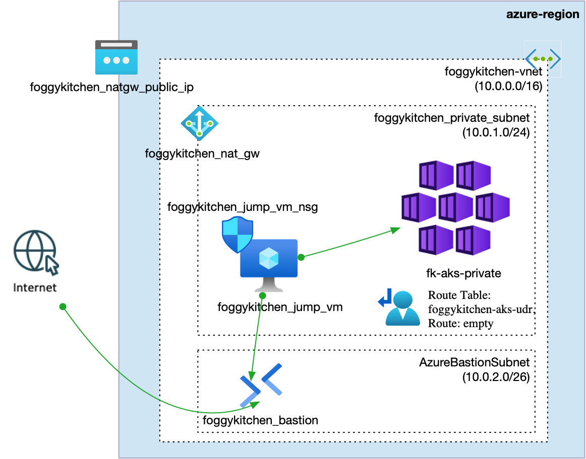
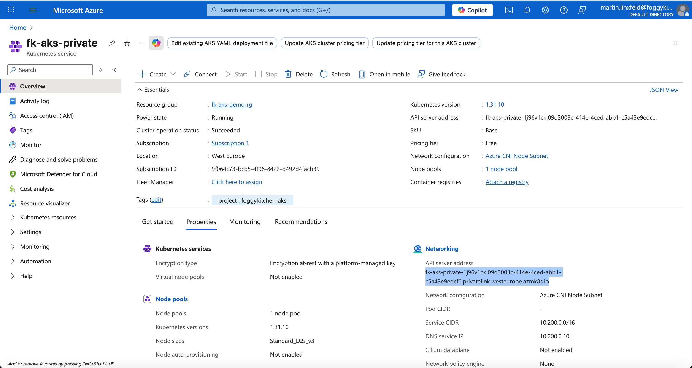

# Lesson 03: Private AKS Cluster with Bastion Access

In this example, we deploy a **private Azure Kubernetes Service (AKS)** cluster whose API server is reachable only from inside the Virtual Network.
The cluster uses **Azure CNI**, `outbound_type = "userDefinedRouting"`, a NAT Gateway for outbound node traffic, and Azure Bastion tunneling through a private jump VM.

`userDefinedRouting` is set intentionally. It tells AKS not to manage outbound traffic through its default Standard Load Balancer path. Instead, outbound connectivity is controlled by the subnet networking that we define in this example. AKS requires the node subnet to have a route table associated when `userDefinedRouting` is enabled, even if that route table has no custom routes. The empty UDR is therefore deliberate: it satisfies the AKS requirement, while NAT Gateway provides the actual outbound internet path for private nodes.

The supporting network, route table, NAT Gateway, Public IP, Bastion host, jump VM, and NSG are created with reusable FoggyKitchen modules.

Related blog post:
[Azure Bastion with Terraform - Secure Access to Private AKS Clusters (Hands-On)](https://foggykitchen.com/2025/11/11/azure-bastion-terraform/)

---

## Architecture Overview



This deployment creates:
- A new **Resource Group**.
- A dedicated **Azure Virtual Network** using `terraform-az-fk-vnet`.
- A private AKS subnet and an `AzureBastionSubnet`.
- A route table associated with the private AKS subnet using `terraform-az-fk-routing`.
- A NAT Gateway associated with the private AKS subnet using `terraform-az-fk-natgw`.
- A dedicated NAT Gateway public IP using `terraform-az-fk-public-ip`.
- An **Azure Bastion** host using `terraform-az-fk-bastion`.
- A private jump VM using `terraform-az-fk-compute`.
- A NIC-level NSG using `terraform-az-fk-nsg` that allows SSH only from the Bastion subnet.
- A private **AKS cluster** using `terraform-az-fk-aks`.

The important parts of this architecture are:
- The AKS API server is private and reachable only through the VNet.
- The jump VM has no public IP address.
- Azure Bastion provides the operator path into the VNet.
- NAT Gateway gives the private subnet outbound internet access.

---

## Module Composition

The VNet module creates both subnets used by AKS and Bastion:

```hcl
module "vnet" {
  source = "github.com/foggykitchen/terraform-az-fk-vnet"

  name                = "foggykitchen-vnet"
  location            = azurerm_resource_group.foggykitchen_rg.location
  resource_group_name = azurerm_resource_group.foggykitchen_rg.name

  address_space = ["10.0.0.0/16"]

  subnets = {
    foggykitchen-private-subnet = {
      address_prefixes = ["10.0.1.0/24"]
    }
    AzureBastionSubnet = {
      address_prefixes = ["10.0.2.0/26"]
    }
  }
}
```

The AKS module consumes the existing VNet and subnet outputs:

```hcl
module "aks" {
  source              = "../.."
  name                = "fk-aks-private"
  location            = azurerm_resource_group.foggykitchen_rg.location
  resource_group_name = azurerm_resource_group.foggykitchen_rg.name

  network_plugin = "azure"
  outbound_type  = "userDefinedRouting"
  vnet_id        = module.vnet.vnet_id
  subnet_id      = module.vnet.subnet_ids["foggykitchen-private-subnet"]

  default_node_count      = 2
  default_node_vm_size    = "Standard_D2s_v3"
  private_cluster_enabled = true
}
```

The route table and NAT Gateway are also composed through FoggyKitchen modules:

```hcl
module "routing" {
  source = "github.com/foggykitchen/terraform-az-fk-routing"

  resource_group_name = azurerm_resource_group.foggykitchen_rg.name

  route_tables = {
    foggykitchen-aks-udr = {
      location = azurerm_resource_group.foggykitchen_rg.location
      subnet_ids = [
        module.vnet.subnet_ids["foggykitchen-private-subnet"]
      ]
    }
  }
}

module "natgw_public_ip" {
  source = "github.com/foggykitchen/terraform-az-fk-public-ip"

  name                = "foggykitchen-natgw-ip"
  location            = azurerm_resource_group.foggykitchen_rg.location
  resource_group_name = azurerm_resource_group.foggykitchen_rg.name
}

module "natgw" {
  source = "github.com/foggykitchen/terraform-az-fk-natgw"

  name                = "foggykitchen-natgw"
  location            = azurerm_resource_group.foggykitchen_rg.location
  resource_group_name = azurerm_resource_group.foggykitchen_rg.name

  create_public_ip = false
  public_ip_id     = module.natgw_public_ip.id

  subnet_associations = {
    private_subnet = {
      subnet_id = module.vnet.subnet_ids["foggykitchen-private-subnet"]
    }
  }
}
```

The jump VM is private and has an NSG attached at NIC level:

```hcl
module "jump_vm" {
  source = "github.com/mlinxfeld/terraform-az-fk-compute"

  name                = "foggykitchen-jump-vm"
  location            = azurerm_resource_group.foggykitchen_rg.location
  resource_group_name = azurerm_resource_group.foggykitchen_rg.name

  deployment_mode = "vm"
  subnet_id       = module.vnet.subnet_ids["foggykitchen-private-subnet"]

  admin_username = "azureuser"
  ssh_public_key = tls_private_key.public_private_key_pair.public_key_openssh
  vm_size        = "Standard_B1s"

  attach_nsg_to_nic = true
  nsg_id            = module.jump_vm_nsg.id
}
```

---

## Deployment Steps

Initialize and apply the OpenTofu configuration:

```bash
tofu init
tofu plan
tofu apply
```

Retrieve the private SSH key generated by OpenTofu:

```bash
tofu output -raw jump_private_key_openssh > ~/.ssh/fk_jumpvm
chmod 600 ~/.ssh/fk_jumpvm
```

Open a Bastion tunnel to the private jump VM:

```bash
az network bastion tunnel \
  --name foggykitchen-bastion \
  --resource-group fk-aks-demo-rg \
  --target-resource-id $(az vm show \
    --resource-group fk-aks-demo-rg \
    --name foggykitchen-jump-vm \
    --query id -o tsv) \
  --resource-port 22 \
  --port 50022
```

In a second terminal, connect through the local tunnel:

```bash
ssh -i ~/.ssh/fk_jumpvm -p 50022 azureuser@127.0.0.1
```

---

## Private AKS Access

You can retrieve AKS credentials directly from the jump VM after logging in with Azure CLI:

```bash
az login
az aks get-credentials \
  --resource-group fk-aks-demo-rg \
  --name fk-aks-private \
  --admin \
  --overwrite-existing
```

For non-interactive training runs, you can also retrieve the admin kubeconfig locally and copy it to the jump VM through the Bastion tunnel:

```bash
az aks get-credentials \
  --resource-group fk-aks-demo-rg \
  --name fk-aks-private \
  --admin \
  --file /tmp/fk-aks-private-kubeconfig \
  --overwrite-existing

ssh -i ~/.ssh/fk_jumpvm -p 50022 azureuser@127.0.0.1 \
  'mkdir -p ~/.kube && chmod 700 ~/.kube'

scp -i ~/.ssh/fk_jumpvm -P 50022 \
  /tmp/fk-aks-private-kubeconfig \
  azureuser@127.0.0.1:/home/azureuser/.kube/config

ssh -i ~/.ssh/fk_jumpvm -p 50022 azureuser@127.0.0.1 \
  'chmod 600 ~/.kube/config'
```

Verify cluster access:

```bash
kubectl cluster-info
kubectl get nodes -o wide
kubectl get pods -A -o wide
```

The private AKS API endpoint should resolve inside the VNet, and nodes should use IPs from the `10.0.1.0/24` subnet.

---

## Smoke Test

Create a small workload:

```bash
kubectl create ns smoke --dry-run=client -o yaml | kubectl apply -f -
kubectl -n smoke create deployment whoami \
  --image=traefik/whoami \
  --replicas=1 \
  --dry-run=client -o yaml | kubectl apply -f -
kubectl -n smoke rollout status deployment/whoami --timeout=120s
kubectl -n smoke get pods -o wide
```

Verify outbound traffic through the private subnet NAT path:

```bash
curl -s ifconfig.me
```

The returned IP should match the NAT Gateway public IP from OpenTofu output:

```bash
tofu output natgw_public_ip
```

In a verified run, the jump VM private IP was `10.0.1.4`, AKS node IPs came from `10.0.1.0/24`, and NAT egress returned the NAT Gateway public IP.

---

## Azure Portal View

After deployment, open the AKS cluster and supporting networking resources in the Azure Portal.
You should see:
- The AKS cluster configured as a private cluster.
- The node subnet associated with the route table and NAT Gateway.
- The private jump VM reachable through Azure Bastion.
- The Bastion and NAT Gateway public IP resources created by their modules.



---

## Cleanup

To remove all resources created by this example:

```bash
tofu destroy
```

---

## Summary

This example demonstrates:
- How to deploy a **private AKS cluster** using OpenTofu.
- How to compose the **FoggyKitchen VNet**, **Routing**, **NAT Gateway**, **Public IP**, **Bastion**, **Compute**, **NSG**, and **AKS** modules.
- How to access a private AKS API server through Azure Bastion and a private jump VM.
- Why `userDefinedRouting` requires a route table association on the AKS subnet.

---

## Learn More

Visit [FoggyKitchen.com](https://foggykitchen.com/) for Azure, multicloud, and Terraform/OpenTofu learning resources.

---

## License

Licensed under the **Universal Permissive License (UPL), Version 1.0**.  
See [LICENSE](../../LICENSE) for more details.
