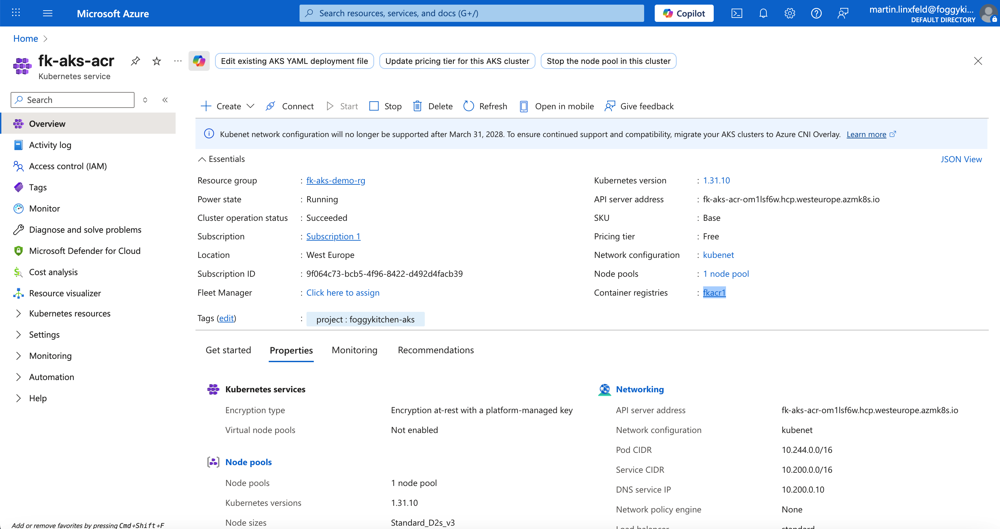

# Lesson 04: AKS Deployment with ACR and Public Load Balancer

This example demonstrates how to build a container image in **Azure Container Registry (ACR)** and deploy it to an **Azure Kubernetes Service (AKS)** cluster using Terraform/OpenTofu. The workload is exposed publicly via a **LoadBalancer** service type.

📘 Related blog post:
[Deploying Container Images to AKS Using Azure Container Registry: Why It Matters](https://foggykitchen.com/2025/11/21/azure-container-registry-terraform/)

---

## 🧱 Architecture Overview

- ACR hosts the container image (`fkacr1.azurecr.io/hello:1.0`)
- AKS cluster is provisioned in the same virtual network
- Terraform automates:
  - ACR build and push (`az acr build`)
  - Kubernetes manifest rendering (`templatefile`)
  - Deployment rollout validation
- A public Azure Load Balancer exposes the service to the Internet

---

## ⚙️ Deployment Steps

```bash
tofu init
tofu apply
```

After the cluster and ACR are ready, Terraform will:
1. Build and push the container image to ACR.
2. Deploy the Kubernetes manifest (`fk-acr-demo.yaml`) using `kubectl`.
3. Wait for the rollout status.

Example output:

```bash
Apply complete! Resources: 11 added, 0 changed, 0 destroyed.

Outputs:

acr_login_server = "fkacr1.azurecr.io"
```

Verify that the pod is running and the service has an external IP:

```bash
kubectl get pods
kubectl get svc fk-acr-demo-svc
```

Example output:

```bash
NAME              TYPE           CLUSTER-IP      EXTERNAL-IP     PORT(S)        AGE
fk-acr-demo-svc   LoadBalancer   10.200.184.22   135.236.43.64   80:32209/TCP   80m
```

Then access your app publicly:

```bash
curl http://135.236.43.64
```

Response:

```bash
Hello, here is FoggyKitchen.com deployed in AKS based on image taken from ACR (fkacr1.azurecr.io/hello:1.0)!
```

---

## 🔐 Network Security Group (NSG)

For the LoadBalancer service to be accessible publicly, the subnet hosting AKS nodes must allow inbound traffic on:
- Port **80/TCP** (frontend rule of the LB)
- Ports **30000–32767/TCP** from `AzureLoadBalancer` (health probes)
- Optionally, the **NodePort** assigned by Kubernetes (e.g. `32209/TCP`)

Example NSG configuration in Terraform:

```hcl
resource "azurerm_network_security_group" "agents" {
  name                = "fk-aks-agents-nsg"
  location            = azurerm_resource_group.foggykitchen_rg.location
  resource_group_name = var.resource_group_name
}

resource "azurerm_subnet_network_security_group_association" "agents_assoc" {
  subnet_id                 = module.aks.subnet_id
  network_security_group_id = azurerm_network_security_group.agents.id
}

# Allow Load Balancer probes
resource "azurerm_network_security_rule" "allow_lb_probes" {
  name                        = "allow-azlb-probes-nodeport"
  priority                    = 200
  direction                   = "Inbound"
  access                      = "Allow"
  protocol                    = "Tcp"
  source_port_range           = "*"
  source_address_prefix       = "AzureLoadBalancer"
  destination_port_ranges     = ["30000-32767"]
  destination_address_prefix  = "*"
  resource_group_name         = var.resource_group_name
  network_security_group_name = azurerm_network_security_group.agents.name
}

# Allow HTTP (port 80)
resource "azurerm_network_security_rule" "allow_http_80" {
  name                        = "allow-http-80"
  priority                    = 205
  direction                   = "Inbound"
  access                      = "Allow"
  protocol                    = "Tcp"
  source_port_range           = "*"
  source_address_prefix       = "*"
  destination_port_range      = "80"
  destination_address_prefix  = "*"
  resource_group_name         = var.resource_group_name
  network_security_group_name = azurerm_network_security_group.agents.name
}

# Allow nodePort access (optional for direct testing)
resource "azurerm_network_security_rule" "allow_http_nodeport" {
  name                        = "allow-http-nodeport"
  priority                    = 210
  direction                   = "Inbound"
  access                      = "Allow"
  protocol                    = "Tcp"
  source_port_range           = "*"
  source_address_prefix       = "*"
  destination_port_range      = "32209"
  destination_address_prefix  = "*"
  resource_group_name         = var.resource_group_name
  network_security_group_name = azurerm_network_security_group.agents.name
}
```

---

## 🧭 Troubleshooting

If `curl` to the EXTERNAL-IP times out:
1. Ensure that the NSG is associated with the AKS subnet.
2. Open port **80/TCP** for Internet traffic.
3. Allow **AzureLoadBalancer** source for health probes.
4. Confirm Load Balancer rule backend port = 80 and probe port = nodePort.

Test from within the cluster:
```bash
kubectl run tmp --image=busybox --restart=Never -- sh -c 'wget -qO- http://fk-acr-demo-svc'
```

---

## 🖼️ Azure Portal View



You can verify in the **Azure Portal** that the AKS cluster is successfully connected to the **Azure Container Registry (ACR)**.  
The overview page also confirms that:
- The cluster is using the **kubenet** network configuration.  
- The **container registry fkacr1** is attached to AKS.  
- The cluster state is **Running** and the **LoadBalancer service** exposes your application publicly.

---

## 🌐 Learn More

Visit [FoggyKitchen.com](https://foggykitchen.com/) for hybrid cloud examples, architecture diagrams, and in-depth learning.

---

## 🪪 License

Licensed under the Universal Permissive License (UPL), Version 1.0.  
See [LICENSE](../../LICENSE) for more details.
