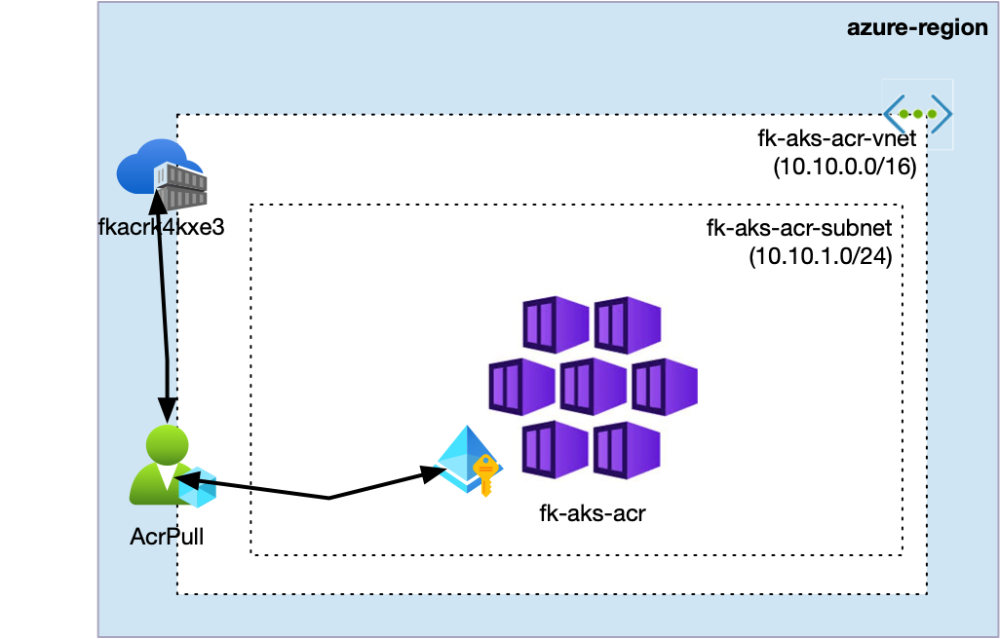
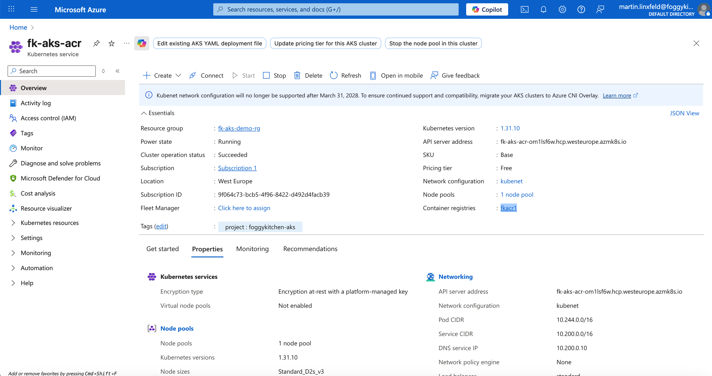

# Lesson 04: AKS with Azure Container Registry

In this example, we deploy an **Azure Kubernetes Service (AKS)** cluster and a dedicated **Azure Container Registry (ACR)**. A small NGINX-based image is built in ACR with `az acr build`, then deployed to AKS from that registry.

The example demonstrates the common AKS and ACR integration pattern:
- ACR is created with the reusable `terraform-az-fk-acr` module.
- AKS is created with the reusable `terraform-az-fk-aks` module.
- The `AcrPull` permission is created with the reusable `terraform-az-fk-rbac` module.
- The RBAC assignment connects the AKS kubelet identity to the ACR scope.
- OpenTofu renders the Kubernetes manifest and applies it with `kubectl`.

Related blog post:
[Deploying Container Images to AKS Using Azure Container Registry: Why It Matters](https://foggykitchen.com/2025/11/21/azure-container-registry-terraform/)

---

## Architecture Overview



This deployment creates:
- A new **Resource Group**.
- An **Azure Container Registry** using `terraform-az-fk-acr`.
- An **AKS cluster** using `terraform-az-fk-aks`.
- Default Kubenet networking created by the AKS module.
- An `AcrPull` role assignment using `terraform-az-fk-rbac`.
- A Kubernetes Deployment that pulls `hello:1.0` from ACR.
- A public Kubernetes `LoadBalancer` Service for the sample app.

---

## Module Composition

The ACR module creates the external registry:

```hcl
module "acr" {
  source = "github.com/mlinxfeld/terraform-az-fk-acr"

  acr_name            = var.acr_name
  location            = azurerm_resource_group.foggykitchen_rg.location
  resource_group_name = azurerm_resource_group.foggykitchen_rg.name

  sku           = "Basic"
  admin_enabled = false
}
```

The AKS module creates the cluster and its default Kubenet network:

```hcl
module "aks" {
  source              = "../.."
  name                = "fk-aks-acr"
  location            = azurerm_resource_group.foggykitchen_rg.location
  resource_group_name = azurerm_resource_group.foggykitchen_rg.name

  create_networking = true
  network_plugin    = "kubenet"
}
```

The RBAC module grants the AKS kubelet identity permission to pull images from ACR:

```hcl
module "acr_pull" {
  source = "github.com/mlinxfeld/terraform-az-fk-rbac"

  scope                = module.acr.acr_id
  principal_id         = module.aks.kubelet_object_id
  role_definition_name = "AcrPull"
}
```

---

## Deployment Steps

ACR names must be globally unique in Azure. If `fkacr1` is already taken, set another value:

```hcl
acr_name = "fkacr12345"
```

Initialize and apply the OpenTofu configuration:

```bash
tofu init
tofu plan
tofu apply
```

During apply, OpenTofu also runs local deployment steps:
1. Renders the Dockerfile, index page, and Kubernetes manifest.
2. Builds and pushes the image with `az acr build`.
3. Retrieves AKS credentials with `az aks get-credentials`.
4. Applies the Kubernetes manifest.
5. Waits for the deployment rollout.

The image is tagged as:

```text
<acr-login-server>/hello:1.0
```

---

## Verification

Check the registry and cluster outputs:

```bash
tofu output acr_name
tofu output acr_login_server
tofu output cluster_name
```

Verify the workload:

```bash
kubectl get pods
kubectl get svc fk-acr-demo-svc
```

In a verified run, the deployment completed during `tofu apply` and the service received a public LoadBalancer IP:

```text
NAME                           READY   STATUS    RESTARTS   AGE
fk-acr-demo-86685f5c48-hh2wb   1/1     Running   0          43s

NAME              TYPE           CLUSTER-IP     EXTERNAL-IP      PORT(S)
fk-acr-demo-svc   LoadBalancer   10.200.181.1   128.251.180.53   80:30375/TCP
```

Wait until the service has an external IP, then test the app:

```bash
APP_IP=$(kubectl get svc fk-acr-demo-svc -o jsonpath='{.status.loadBalancer.ingress[0].ip}')
curl "http://${APP_IP}"
```

Expected response:

```text
Hello, here is FoggyKitchen.com deployed in AKS based on image taken from ACR (<acr-login-server>/hello:1.0)!
```

If you run the test from a restricted execution environment, make sure outbound HTTP to the LoadBalancer IP is allowed. The Kubernetes deployment can also be checked from inside the cluster:

```bash
kubectl run tmp-check --rm -i --restart=Never --image=busybox:1.36 -- \
  wget -qO- http://fk-acr-demo-svc.default.svc.cluster.local
```

You can also verify that AKS can pull from ACR through the role assignment:

```bash
az role assignment list \
  --scope $(tofu output -raw acr_id) \
  --query "[].{role:roleDefinitionName, principal:principalId}" \
  -o table
```

---

## Azure Portal View

Open the AKS cluster and ACR in the Azure Portal.
You should see:
- The AKS cluster using Kubenet networking.
- The ACR created in the same resource group.
- The AKS kubelet identity assigned `AcrPull` on the registry through the RBAC module.
- The `fk-acr-demo-svc` LoadBalancer service exposing the application publicly.



---

## Cleanup

To remove all resources created by this example:

```bash
tofu destroy
```

---

## Summary

This example demonstrates:
- How to deploy AKS with OpenTofu.
- How to create ACR with a separate reusable module.
- How to grant AKS access to ACR with a separate RBAC module.
- How to build an image with `az acr build`.
- How to deploy and expose a workload from ACR on AKS.

---

## Learn More

Visit [FoggyKitchen.com](https://foggykitchen.com/) for Azure, multicloud, and Terraform/OpenTofu learning resources.

---

## License

Licensed under the Universal Permissive License (UPL), Version 1.0.  
See [LICENSE](../../LICENSE) for more details.
