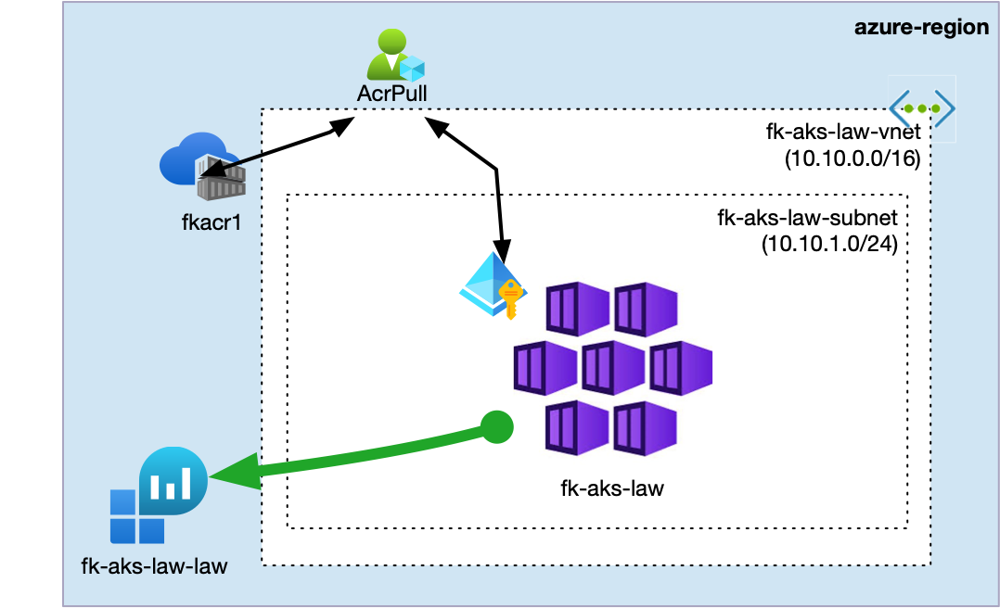
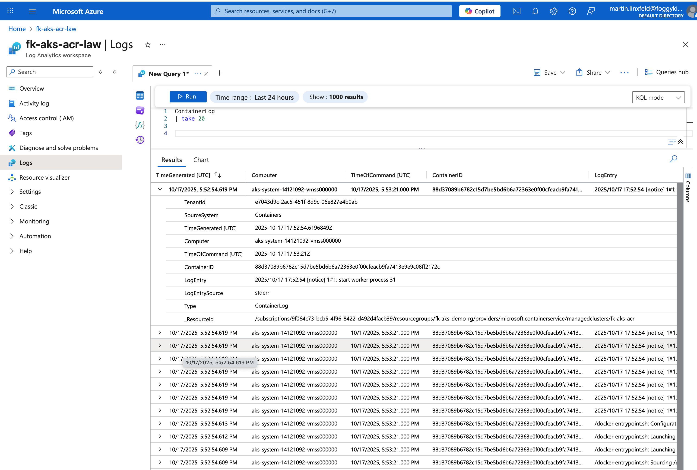

# Lesson 05: AKS with Log Analytics

In this example, we deploy an **Azure Kubernetes Service (AKS)** cluster with **Azure Monitor for Containers** enabled through the OMS add-on. The deployment also creates an external **Azure Container Registry (ACR)**, builds a small NGINX-based image with `az acr build`, and deploys it to AKS.

The example demonstrates a monitored AKS workload built from reusable modules:
- ACR is created with the reusable `terraform-az-fk-acr` module.
- AKS is created with the reusable `terraform-az-fk-aks` module.
- The Log Analytics Workspace is created by the AKS module and connected through the `oms_agent` integration.
- The `AcrPull` permission is created with the reusable `terraform-az-fk-rbac` module.
- OpenTofu renders the Kubernetes manifest and applies it with `kubectl`.

Related blog post:
[AKS Log Analytics with Terraform - How the FoggyKitchen Module Automates Azure Monitor Integration](https://foggykitchen.com/2025/11/24/aks-log-analytics-terraform/)

---

## Architecture Overview



This deployment creates:
- A new **Resource Group**.
- An **Azure Container Registry** using `terraform-az-fk-acr`.
- An **AKS cluster** using `terraform-az-fk-aks`.
- Default Kubenet networking created by the AKS module.
- A **Log Analytics Workspace** created by the AKS module.
- The AKS **OMS agent** add-on connected to the workspace.
- An `AcrPull` role assignment using `terraform-az-fk-rbac`.
- A Kubernetes Deployment that pulls `hello:1.0` from ACR.
- A public Kubernetes `LoadBalancer` Service for the sample app.

---

## Module Composition

The ACR module creates the external registry:

```hcl
module "acr" {
  source = "github.com/mlinxfeld/terraform-az-fk-acr"

  acr_name            = var.acr_name
  location            = azurerm_resource_group.foggykitchen_rg.location
  resource_group_name = azurerm_resource_group.foggykitchen_rg.name

  sku           = "Basic"
  admin_enabled = false
}
```

The AKS module creates the cluster, its default Kubenet network, and the Log Analytics Workspace:

```hcl
module "aks" {
  source              = "../.."
  name                = "fk-aks-law"
  location            = azurerm_resource_group.foggykitchen_rg.location
  resource_group_name = azurerm_resource_group.foggykitchen_rg.name

  create_networking = true
  network_plugin    = "kubenet"

  enable_log_analytics = true
  create_law           = true
  monitoring_mode      = "oms"
}
```

The RBAC module grants the AKS kubelet identity permission to pull images from ACR:

```hcl
module "acr_pull" {
  source = "github.com/mlinxfeld/terraform-az-fk-rbac"

  scope                = module.acr.acr_id
  principal_id         = module.aks.kubelet_object_id
  role_definition_name = "AcrPull"
}
```

---

## Deployment Steps

ACR names must be globally unique in Azure. If `fkacr1` is already taken, set another value:

```hcl
acr_name = "fkacr12345"
```

Initialize and apply the OpenTofu configuration:

```bash
tofu init
tofu plan
tofu apply
```

During apply, OpenTofu also runs local deployment steps:
1. Renders the Dockerfile, index page, and Kubernetes manifest.
2. Builds and pushes the image with `az acr build`.
3. Retrieves AKS credentials with `az aks get-credentials`.
4. Applies the Kubernetes manifest.
5. Waits for the deployment rollout.

---

## Verification

Check the registry, cluster, and Log Analytics outputs:

```bash
tofu output acr_name
tofu output acr_login_server
tofu output cluster_name
tofu output log_analytics_workspace_id
```

Verify the OMS add-on configuration:

```bash
az aks show \
  -g fk-aks-demo-rg \
  -n fk-aks-law \
  --query addonProfiles.omsagent
```

Verify the workload:

```bash
kubectl get pods
kubectl get svc fk-acr-demo-svc
```

Wait until the service has an external IP, then test the app:

```bash
APP_IP=$(kubectl get svc fk-acr-demo-svc -o jsonpath='{.status.loadBalancer.ingress[0].ip}')
curl "http://${APP_IP}"
```

Expected response:

```text
Hello, here is FoggyKitchen.com deployed in AKS based on image taken from ACR (<acr-login-server>/hello:1.0)!
```

You can also verify that AKS can pull from ACR through the role assignment:

```bash
az role assignment list \
  --scope $(tofu output -raw acr_id) \
  --query "[].{role:roleDefinitionName, principal:principalId}" \
  -o table
```

Container logs and inventory become available in the Log Analytics Workspace after Azure Monitor starts collecting data. Useful KQL tables include:
- `ContainerLog`
- `KubePodInventory`
- `InsightsMetrics`
- `Perf`

Telemetry ingestion is not immediate. After a fresh `tofu apply`, wait about 5 minutes before expecting Kubernetes inventory and metrics to appear in Log Analytics.

Check whether data has arrived:

```kusto
KubePodInventory
| count
```

Example query:

```kusto
KubePodInventory
| where Namespace == "default"
| take 20
```

---

## Azure Portal View

Open the AKS cluster in the Azure Portal and go to **Insights**. You should see the cluster connected to the Log Analytics Workspace created by the module.

Open the Log Analytics Workspace and go to **Logs** to query collected Kubernetes telemetry.



---

## Cleanup

To remove all resources created by this example:

```bash
tofu destroy
```

When Azure Monitor for Containers is enabled, Azure can create an additional solution resource in the same resource group:

```text
Microsoft.OperationsManagement/solutions/ContainerInsights(<workspace-name>)
```

If `tofu destroy` removes the AKS cluster, ACR, Log Analytics Workspace, and networking but then fails while deleting the resource group because this `ContainerInsights(...)` resource still exists, remove the solution resource with Azure CLI and rerun `tofu destroy`:

```bash
az resource delete \
  --ids "/subscriptions/<subscription-id>/resourceGroups/fk-aks-demo-rg/providers/Microsoft.OperationsManagement/solutions/ContainerInsights(fk-aks-law-law)"

tofu destroy
```

You can list remaining resources in the resource group with:

```bash
az resource list \
  -g fk-aks-demo-rg \
  --query "[].{name:name,type:type}" \
  -o table
```

---

## Summary

This example demonstrates:
- How to deploy AKS with OpenTofu.
- How to enable Azure Monitor for Containers through the OMS add-on.
- How to create a Log Analytics Workspace through the AKS module.
- How to create ACR with a separate reusable module.
- How to grant AKS access to ACR with a separate RBAC module.
- How to deploy and expose a workload whose logs can be collected by Azure Monitor.

---

## Learn More

Visit [FoggyKitchen.com](https://foggykitchen.com/) for Azure, multicloud, and Terraform/OpenTofu learning resources.

---

## License

Licensed under the Universal Permissive License (UPL), Version 1.0.  
See [LICENSE](../../LICENSE) for more details.
