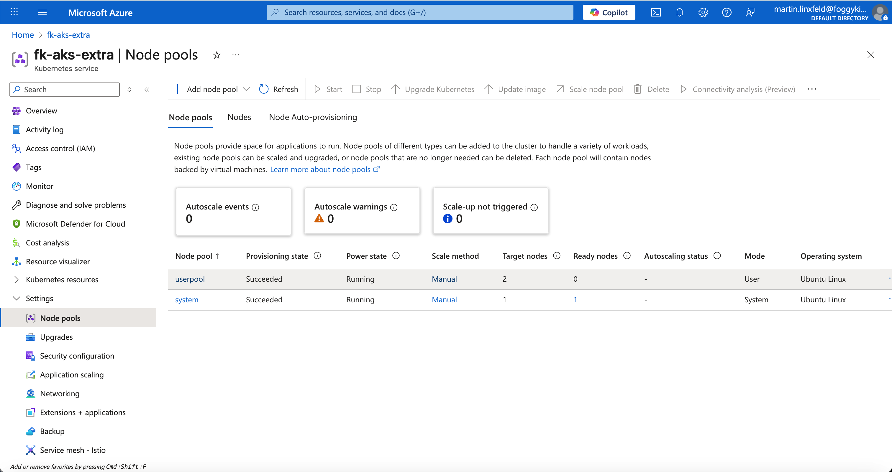

# Module 06 – Additional Node Pools in Azure Kubernetes Service (AKS)

In this lesson, we extend the AKS cluster by adding **additional node pools**.  
Each pool can have its own VM size, scaling policy, and labels for targeted workloads.  
This example provisions a **User Pool** using the module’s `additional_node_pools` variable.

---

## 📘 Variables

```hcl
variable "resource_group_name" {
  description = "The name of the Azure Resource Group where resources will be created"
  type        = string
}

variable "location" {
  description = "Azure region (e.g., East US, West Europe)"
  type        = string
}

variable "additional_node_pools" {
  description = "Additional Node Pool definition"
  default = [
    {
      name                 = "userpool"
      vm_size              = "Standard_D2s_v3"
      node_count           = 2         
      mode                 = "User"
      orchestrator_version = null
      subnet_id            = null                  
      taints               = ["dedicated=user:NoSchedule"]
      labels               = { workload = "apps", sku = "general" }
      max_pods             = 30
      enable_auto_scaling  = false
      min_count            = null
      max_count            = null
      spot                 = false
    }
  ]
}
```

---

## 🧠 Concept

The `additional_node_pools` variable allows you to dynamically define multiple pools in AKS.  
Each can use a different VM size, scaling configuration, and taints/labels for workload separation — for example:
- **System pool** → default system services.  
- **User pool** → app workloads.  

---

## 🚀 Steps

```bash
# 1. Initialize Terraform / OpenTofu
tofu init
tofu apply

# 2. Fetch kubeconfig
az aks get-credentials -g fk-aks-demo-rg -n fk-aks-extra --overwrite-existing

# 3. Verify nodes and labels
kubectl get nodes -L agentpool,workload,sku

# 4. Deploy workloads on the new pool
kubectl apply -f manifests/app-on-userpool.yaml
```

---

## 🖼️ Azure Portal View



You can see the **userpool** created next to the system pool under the *Node pools* tab.

---

## 🌐 Learn More

Visit [FoggyKitchen.com](https://foggykitchen.com/) for more hybrid cloud examples, architecture diagrams, and in-depth learning.

---

## 🪪 License

Licensed under the Universal Permissive License (UPL), Version 1.0.  
See [LICENSE](../../LICENSE) for more details.
