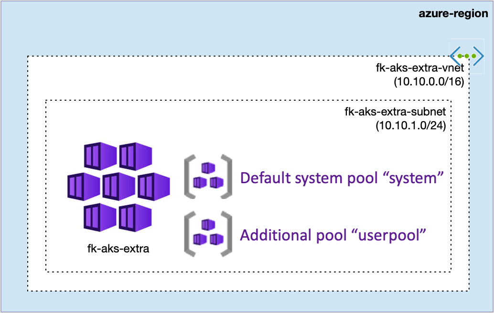
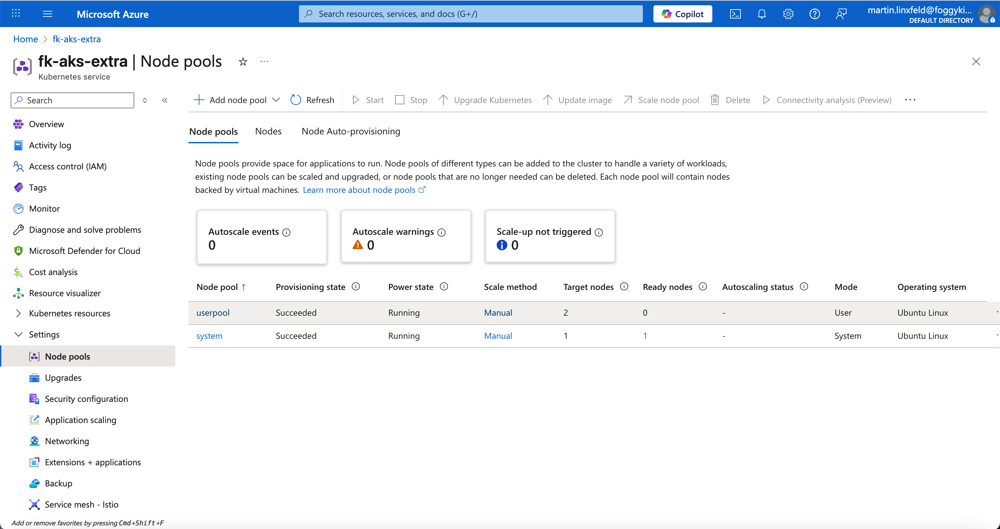

# Lesson 06: Additional AKS Node Pools

In this example, we deploy an **Azure Kubernetes Service (AKS)** cluster with a default system node pool and an additional **User** node pool. The additional pool is configured with labels and taints, then a sample workload is scheduled onto it with `nodeSelector` and `tolerations`.

The example demonstrates the reusable AKS module support for `additional_node_pools`:
- AKS is created with the reusable `terraform-az-fk-aks` module.
- Default Kubenet networking is created by the AKS module.
- A user node pool named `userpool` is created next to the default `system` pool.
- The user pool receives labels `workload=apps` and `sku=general`.
- The user pool receives taint `dedicated=user:NoSchedule`.
- OpenTofu renders a Kubernetes manifest and applies it with `kubectl`.

Related blog post:
[Creating an Additional AKS Node Pool with Terraform/OpenTofu (Step-by-Step)](https://foggykitchen.com/2025/11/28/aks-additional-node-pool-terraform/)

---

## Architecture Overview



This deployment creates:
- A new **Resource Group**.
- An **AKS cluster** using `terraform-az-fk-aks`.
- Default Kubenet networking created by the AKS module.
- The default `system` node pool for AKS system workloads.
- An additional `userpool` node pool for application workloads.
- A Kubernetes Deployment scheduled onto `userpool`.

---

## Module Composition

The AKS module creates the cluster and additional node pool:

```hcl
module "aks" {
  source              = "../.."
  name                = "fk-aks-extra"
  location            = azurerm_resource_group.foggykitchen_rg.location
  resource_group_name = azurerm_resource_group.foggykitchen_rg.name

  create_networking = true
  network_plugin    = "kubenet"

  additional_node_pools = var.additional_node_pools
}
```

The additional pool is defined as input data:

```hcl
additional_node_pools = [
  {
    name                 = "userpool"
    vm_size              = "Standard_D2s_v3"
    node_count           = 2
    mode                 = "User"
    orchestrator_version = null
    subnet_id            = null
    taints               = ["dedicated=user:NoSchedule"]
    labels               = { workload = "apps", sku = "general" }
    max_pods             = 30
    enable_auto_scaling  = false
    min_count            = null
    max_count            = null
    spot                 = false
  }
]
```

The workload targets the user pool with a matching toleration and node selector:

```yaml
tolerations:
  - key: "dedicated"
    operator: "Equal"
    value: "user"
    effect: "NoSchedule"
nodeSelector:
  workload: "apps"
```

---

## Deployment Steps

Initialize and apply the OpenTofu configuration:

```bash
tofu init
tofu plan
tofu apply
```

During apply, OpenTofu also runs local deployment steps:
1. Renders the Kubernetes manifest into `generated/app-on-userpool.yaml`.
2. Retrieves AKS credentials with `az aks get-credentials`.
3. Lists nodes with their `agentpool`, `workload`, and `sku` labels.
4. Applies the Kubernetes manifest.
5. Waits for the deployment rollout.

---

## Verification

Check the cluster output:

```bash
tofu output cluster_name
```

Verify node pools and labels:

```bash
kubectl get nodes -L agentpool,workload,sku
```

The `system` pool should host the default AKS components, while the `userpool` nodes should have the labels used by the workload:

```text
agentpool=userpool
workload=apps
sku=general
```

Verify that the sample app pods are running on `userpool` nodes:

```bash
kubectl get pods -l app=demo -o wide
```

In a verified run, `tofu apply` completed with:

```text
Apply complete! Resources: 7 added, 0 changed, 0 destroyed.
```

The cluster had one `system` node and two `userpool` nodes with expected labels:

```text
aks-system-...      Ready   agentpool=system
aks-userpool-...    Ready   agentpool=userpool   workload=apps   sku=general
aks-userpool-...    Ready   agentpool=userpool   workload=apps   sku=general
```

The workload pods were running on `aks-userpool-*` nodes:

```text
app-on-userpool-...   1/1 Running   NODE aks-userpool-...-vmss000000
app-on-userpool-...   1/1 Running   NODE aks-userpool-...-vmss000000
```

You can also inspect the generated manifest:

```bash
cat generated/app-on-userpool.yaml
```

---

## Azure Portal View

Open the AKS cluster in the Azure Portal and go to **Node pools**. You should see the default `system` pool and the additional `userpool`.



---

## Cleanup

To remove all resources created by this example:

```bash
tofu destroy
```

---

## Summary

This example demonstrates:
- How to deploy AKS with OpenTofu.
- How to add user node pools with the AKS module.
- How to use labels and taints for workload separation.
- How to schedule Kubernetes workloads onto a specific AKS node pool.

---

## Learn More

Visit [FoggyKitchen.com](https://foggykitchen.com/) for Azure, multicloud, and Terraform/OpenTofu learning resources.

---

## License

Licensed under the Universal Permissive License (UPL), Version 1.0.  
See [LICENSE](../../LICENSE) for more details.
