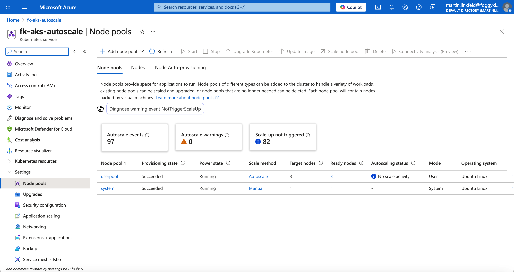

# Lesson 07: AKS Cluster Autoscaling

In this lesson, you will learn how to enable and test **Cluster Autoscaler** in Azure Kubernetes Service (AKS). The autoscaler dynamically adjusts the number of nodes in your node pool based on the resource requirements of your running pods.

This lesson builds directly on top of the module from [Lesson 06](../06-additional-pools) and focuses on scaling behavior under load.

---

## 🚀 Overview

The **Cluster Autoscaler** monitors pods that cannot be scheduled due to insufficient resources. When it detects such pods, it automatically scales up the number of nodes in the pool. Conversely, when nodes are underutilized for an extended period, it scales down to save costs.

In this exercise, you will:
- Configure a **User Pool** with autoscaling enabled.
- Deploy a CPU-intensive workload that triggers scale-up.
- Observe AKS dynamically adding new nodes.
- Optionally deploy an **Horizontal Pod Autoscaler (HPA)**.

---

## 🧱 Terraform Configuration

The module definition for the additional node pool includes autoscaling parameters:

```hcl
variable "additional_node_pools" {
  description = "Additional Node Pool definition"
  default = [
    {
      name                 = "userpool"
      vm_size              = "Standard_D2s_v3"
      node_count           = 0                 # Autoscaler starts from 0
      mode                 = "User"
      orchestrator_version = null
      subnet_id            = null
      taints               = []                # No taints for simplicity
      labels               = { workload = "apps", sku = "general" }
      max_pods             = 30
      enable_auto_scaling  = true
      min_count            = 0
      max_count            = 3
      spot                 = false
    }
  ]
}
```

After applying the configuration, your cluster will have a **system pool** and one **user pool** configured for autoscaling.

---

## 🧩 Workload Manifest

The deployment below creates multiple CPU-bound pods to trigger a scale-up event.

```yaml
apiVersion: apps/v1
kind: Deployment
metadata:
  name: heavy-deploy
spec:
  replicas: 25
  selector:
    matchLabels:
      app: heavy
  template:
    metadata:
      labels:
        app: heavy
    spec:
      nodeSelector:
        workload: "apps"
      containers:
      - name: cpu-burn
        image: nginx:stable
        resources:
          requests:
            cpu: "250m"
            memory: "128Mi"
          limits:
            cpu: "500m"
            memory: "256Mi"
        ports:
        - containerPort: 80
```

Deploy it using:
```bash
kubectl apply -f manifests/heavy-deploy.yaml
kubectl get pods -l app=heavy -o wide
```

You should see many pods in the **Pending** state initially — then the Cluster Autoscaler will automatically start provisioning new nodes to accommodate them.

---

## 🖼️ Azure Portal View



The **Node Pools** tab in the Azure Portal shows how the `userpool` dynamically scales from 0 to multiple nodes in response to load.

---

## 🔍 Observing Autoscaling Activity

### Watch node changes
```bash
kubectl get nodes -w
```

### Check pending pods
```bash
kubectl get pods -l app=heavy -o wide
```

### Describe a single pod to see scheduling reasons
```bash
POD=$(kubectl get pods -l app=heavy -o jsonpath='{.items[0].metadata.name}')
kubectl describe pod $POD | sed -n '/Events/,$p'
```

### View autoscaler logs
```bash
kubectl -n kube-system logs -l app=cluster-autoscaler --tail=200 --timestamps
```

### Inspect node pool details
```bash
az aks nodepool show -g fk-aks-demo-rg --cluster-name fk-aks-autoscale -n userpool \
  --query "{scale:enableAutoScaling,min:minCount,max:maxCount,labels:nodeLabels}"
```

---

## 🧠 Key Concepts

- **Scale from zero** requires the scheduler to match pods with the node pool template (labels, taints, selectors).
- **Cluster Autoscaler** reacts to Pending pods; provisioning may take several minutes.
- **Horizontal Pod Autoscaler (HPA)** operates independently and adjusts pod replicas within a deployment.

---

## 🧹 Cleanup

To remove resources:
```bash
kubectl delete -f manifests/heavy-deploy.yaml --ignore-not-found
kubectl delete -f manifests/hpa-optional.yaml --ignore-not-found

tofu destroy
```

---

## 🌐 Learn More

Visit [FoggyKitchen.com](https://foggykitchen.com/) for more hybrid cloud examples, architecture diagrams, and in-depth learning.

---

## 🪪 License

Licensed under the Universal Permissive License (UPL), Version 1.0.  
See [LICENSE](../../LICENSE) for more details.