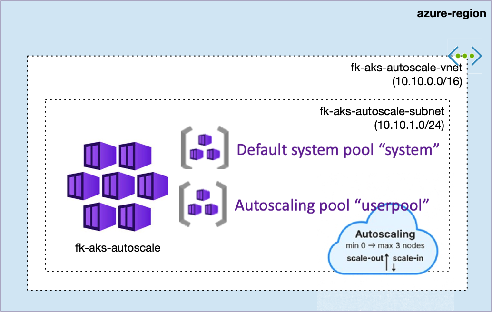
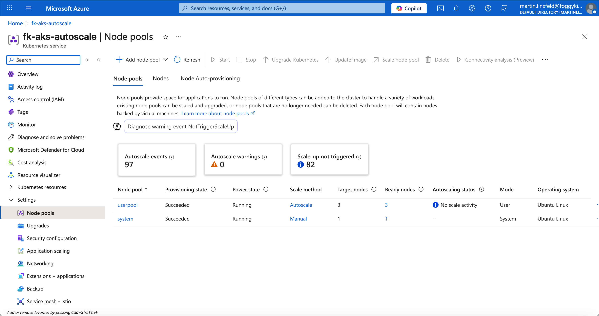

# Lesson 07: AKS Cluster Autoscaling

In this example, we deploy an **Azure Kubernetes Service (AKS)** cluster with an additional **User** node pool configured for **Cluster Autoscaler**. The user pool starts at zero nodes and scales up when a workload cannot be scheduled immediately.

The example builds on the reusable AKS module pattern from [Lesson 06](../06-additional-pools) and focuses on scaling behavior under load:
- AKS is created with the reusable `terraform-az-fk-aks` module.
- Default Kubenet networking is created by the AKS module.
- A user node pool named `userpool` is configured with autoscaling enabled.
- A CPU-heavy workload is deployed to trigger scale-up.
- OpenTofu renders the Kubernetes manifest and applies it with `kubectl`.

Related blog post:
[AKS Autoscaling Node Pools with Terraform/OpenTofu - Turning Static Clusters into Elastic Infrastructure](https://foggykitchen.com/2025/12/07/aks-autoscaler-terraform/)

---

## Architecture Overview



This deployment creates:
- A new **Resource Group**.
- An **AKS cluster** using `terraform-az-fk-aks`.
- Default Kubenet networking created by the AKS module.
- The default `system` node pool.
- An additional `userpool` configured with Cluster Autoscaler.
- A workload that drives the user pool from zero to multiple nodes.

---

## Module Composition

The AKS module creates the cluster and the autoscaled user pool:

```hcl
module "aks" {
  source              = "../.."
  name                = "fk-aks-autoscale"
  location            = azurerm_resource_group.foggykitchen_rg.location
  resource_group_name = azurerm_resource_group.foggykitchen_rg.name

  create_networking = true
  network_plugin    = "kubenet"

  additional_node_pools = var.additional_node_pools
}
```

The autoscaled user pool is defined as input data:

```hcl
additional_node_pools = [
  {
    name                 = "userpool"
    vm_size              = "Standard_D2s_v3"
    node_count           = 0
    mode                 = "User"
    orchestrator_version = null
    subnet_id            = null
    taints               = ["dedicated=user:NoSchedule"]
    labels               = { workload = "apps", sku = "general" }
    max_pods             = 30
    enable_auto_scaling   = true
    min_count            = 0
    max_count            = 3
    spot                 = false
  }
]
```

The workload targets the user pool with a matching toleration and node selector:

```yaml
tolerations:
  - key: "dedicated"
    operator: "Equal"
    value: "user"
    effect: "NoSchedule"
nodeSelector:
  workload: "apps"
```

---

## Deployment Steps

Initialize and apply the OpenTofu configuration:

```bash
tofu init
tofu plan
tofu apply
```

During apply, OpenTofu also runs local deployment steps:
1. Renders the Kubernetes manifest into `generated/heavy-deploy.yaml`.
2. Retrieves AKS credentials with `az aks get-credentials`.
3. Lists nodes with their `agentpool`, `workload`, and `sku` labels.
4. Applies the Kubernetes manifest.
5. Waits for the deployment rollout.

Scale-from-zero can take several minutes. The user pool may stay at `0` nodes until the scheduler sees Pending pods that match the pool template.

The initial rollout can take longer than a few minutes while the autoscaler provisions the first user-pool nodes. If you see the rollout waiting, that is expected.

---

## Verification

Check the cluster and node pool:

```bash
kubectl get nodes -L agentpool,workload,sku
az aks nodepool show -g fk-aks-demo-rg --cluster-name fk-aks-autoscale -n userpool \
  --query "{scale:enableAutoScaling,min:minCount,max:maxCount,labels:nodeLabels}"
```

Observe the workload:

```bash
kubectl get pods -l app=heavy -o wide
```

In a verified run, `tofu apply` completed with:

```text
Apply complete! Resources: 7 added, 0 changed, 0 destroyed.
```

The cluster started with one `system` node and the `userpool` scaled up to multiple nodes after the workload was applied.

You can also inspect autoscaler activity:

```bash
kubectl -n kube-system logs -l app=cluster-autoscaler --tail=200 --timestamps
```

---

## Azure Portal View

Open the AKS cluster in the Azure Portal and go to **Node pools**. You should see the default `system` pool and the additional `userpool` scaling up in response to load.



---

## Cleanup

To remove all resources created by this example:

```bash
tofu destroy
```

---

## Summary

This example demonstrates:
- How to deploy AKS with OpenTofu.
- How to configure an additional node pool with Cluster Autoscaler.
- How to use labels and taints for workload separation.
- How to trigger scale-up with a Kubernetes workload.

---

## Learn More

Visit [FoggyKitchen.com](https://foggykitchen.com/) for Azure, multicloud, and Terraform/OpenTofu learning resources.

---

## License

Licensed under the Universal Permissive License (UPL), Version 1.0.  
See [LICENSE](../../LICENSE) for more details.
