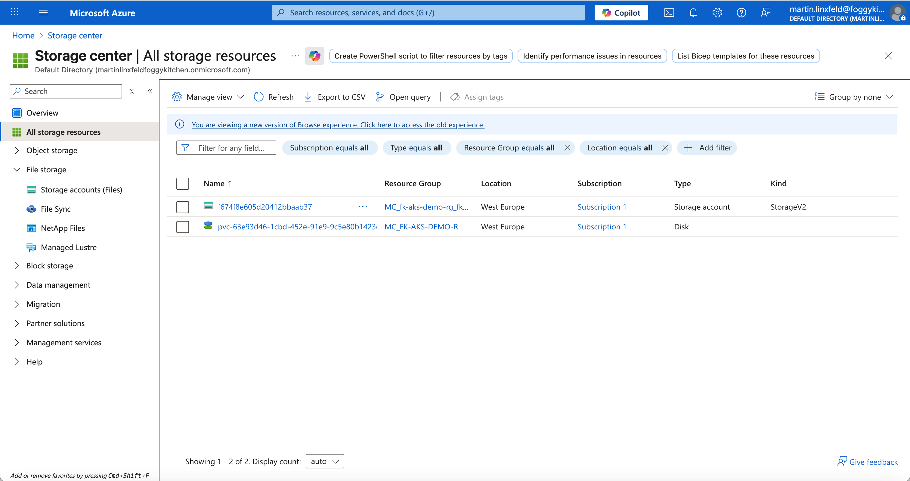

# Lesson 08: Persistent Storage in AKS

In this lesson, you will learn how to dynamically provision persistent storage in **Azure Kubernetes Service (AKS)** using **Container Storage Interface (CSI)** drivers for **Azure Disk** and **Azure Files**.

This module demonstrates how AKS automatically creates and attaches storage resources on Azure — without any manual provisioning through Terraform — using declarative Kubernetes manifests.

---

## 🚀 Overview

The **Azure Disk CSI Driver** and **Azure File CSI Driver** allow you to attach durable storage to your workloads. Kubernetes dynamically provisions Azure-managed storage resources when you create PersistentVolumeClaims (PVCs), using the appropriate StorageClass.

In this exercise, you will:
- Create a **StorageClass** for Managed Disks (RWO)
- Create a **StorageClass** for Azure Files (RWX)
- Deploy sample Pods and Deployments that consume those volumes
- Observe automatic provisioning of Azure Disks and File Shares in the Azure Portal

---

## 🧱 Dynamic Provisioning Examples

### A. Azure Managed Disk (ReadWriteOnce)

This configuration provisions a new **Managed Disk** automatically when the PVC is created.

```yaml
apiVersion: storage.k8s.io/v1
kind: StorageClass
metadata:
  name: managed-csi
provisioner: disk.csi.azure.com
parameters:
  skuname: StandardSSD_LRS
reclaimPolicy: Delete
volumeBindingMode: WaitForFirstConsumer
---
apiVersion: v1
kind: PersistentVolumeClaim
metadata:
  name: disk-pvc
spec:
  accessModes:
  - ReadWriteOnce
  storageClassName: managed-csi
  resources:
    requests:
      storage: 5Gi
---
apiVersion: v1
kind: Pod
metadata:
  name: disk-demo
spec:
  containers:
  - name: disk-demo
    image: nginx
    volumeMounts:
    - mountPath: "/mnt/azure"
      name: volume
  volumes:
  - name: volume
    persistentVolumeClaim:
      claimName: disk-pvc
```

Run the following commands to deploy and verify:
```bash
kubectl apply -f generated/disk-demo.yaml
kubectl get pvc,pv
kubectl get pods -o wide
```

💡 **Expected Result:** A new Managed Disk (`kubernetes-dynamic-...`) appears in your AKS resource group.

---

### B. Azure Files (ReadWriteMany)

This configuration provisions a new **File Share** inside a dynamically created **Storage Account**.

```yaml
apiVersion: storage.k8s.io/v1
kind: StorageClass
metadata:
  name: azurefile-csi
provisioner: file.csi.azure.com
parameters:
  skuName: Standard_LRS
reclaimPolicy: Delete
volumeBindingMode: Immediate
---
apiVersion: v1
kind: PersistentVolumeClaim
metadata:
  name: file-pvc
spec:
  accessModes:
  - ReadWriteMany
  storageClassName: azurefile-csi
  resources:
    requests:
      storage: 5Gi
---
apiVersion: apps/v1
kind: Deployment
metadata:
  name: file-demo
spec:
  replicas: 2
  selector:
    matchLabels:
      app: file-demo
  template:
    metadata:
      labels:
        app: file-demo
    spec:
      containers:
      - name: nginx
        image: nginx
        volumeMounts:
        - mountPath: "/mnt/azurefile"
          name: volume
      volumes:
      - name: volume
        persistentVolumeClaim:
          claimName: file-pvc
```

Deploy and check resources:
```bash
kubectl apply -f generated/file-demo.yaml
kubectl get pvc,pv
kubectl get pods -o wide
```

�� **Expected Result:** A new Azure Storage Account with a File Share (`kubernetes-dynamic-...`) is automatically created.

---

## 🖼️ Azure Portal View



You can see both dynamically created resources:
- A Managed Disk used by the Azure Disk CSI driver (RWO)
- A Storage Account with File Share used by the Azure File CSI driver (RWX)

---

## 🔍 Validation & Insights

Check the created volumes and their bindings:
```bash
kubectl get sc,pvc,pv
kubectl describe pvc disk-pvc
kubectl describe pvc file-pvc
```

Inspect pod mounts:
```bash
kubectl exec -it disk-demo -- df -h /mnt/azure
kubectl exec -it deploy/file-demo -c nginx -- df -h /mnt/azurefile
```

In Azure Portal, verify that AKS created the following:
- A Managed Disk with prefix `kubernetes-dynamic-...`
- A Storage Account (typically `mc_...`) containing the dynamic File Share

---

## 🧠 Key Concepts

- **CSI (Container Storage Interface)** allows Kubernetes to dynamically request cloud storage.
- **ReadWriteOnce (RWO)** volumes can be mounted by a single node at a time.
- **ReadWriteMany (RWX)** volumes can be mounted by multiple nodes simultaneously.
- AKS automatically provisions the corresponding Azure resources when PVCs are created.

---

## 🧹 Cleanup

Remove resources when done:
```bash
kubectl delete -f generated/disk-demo.yaml
kubectl delete -f generated/file-demo.yaml
```
This will also delete the dynamically provisioned Disks and File Shares.

---

## 🌐 Learn More

Visit [FoggyKitchen.com](https://foggykitchen.com/) for more hybrid cloud examples, architecture diagrams, and in-depth learning.

---

## 🪪 License

Licensed under the Universal Permissive License (UPL), Version 1.0.  
See [LICENSE](../../LICENSE) for more details.

---

💡 *In the upcoming AKS vs OKE course, we’ll explore how to pre-provision Azure Files and OCI File Storage via Terraform and attach them to workloads declaratively.*


