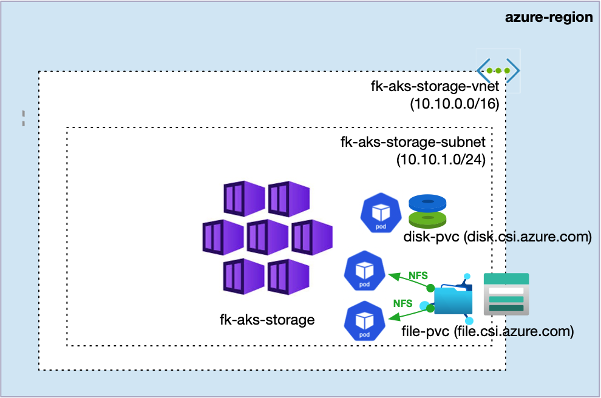
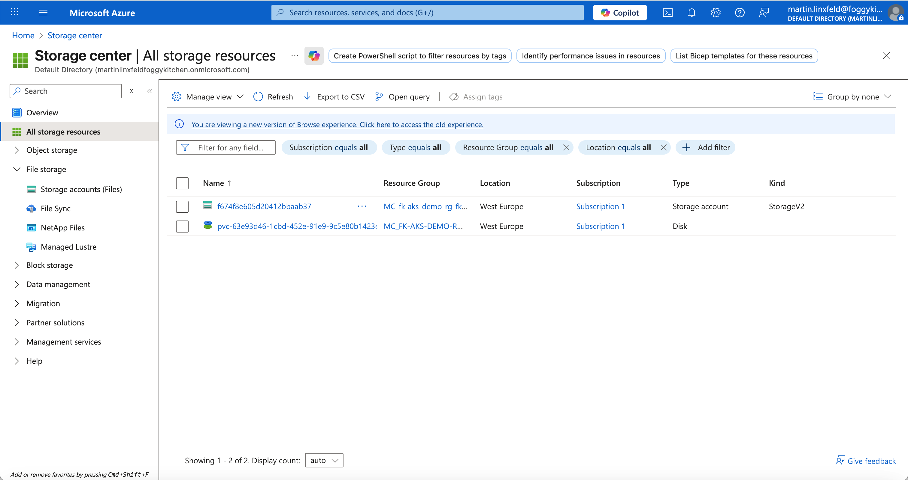

# Lesson 08: Persistent Storage in AKS

In this example, we deploy an **Azure Kubernetes Service (AKS)** cluster and let Kubernetes dynamically provision persistent storage through the **CSI drivers** for **Azure Disk** and **Azure Files**. The storage resources are created by the cluster when the PVCs appear, not by Terraform.

The example demonstrates storage-backed workloads built from reusable modules:
- AKS is created with the reusable `terraform-az-fk-aks` module.
- Default Kubenet networking is created by the AKS module.
- A sample pod consumes an Azure Disk-backed PVC.
- A sample deployment consumes an Azure Files-backed PVC.
- OpenTofu renders the Kubernetes manifests and applies them with `kubectl`.

Related blog posts:
1. [Persistent Volumes in AKS with Terraform - The Role of Azure Managed Disks](https://foggykitchen.com/2025/12/09/aks-persistent-storage-terraform/)
2. [AKS File Share with Terraform - RWX Storage for Multi-Replica Applications](https://foggykitchen.com/2025/12/11/aks-file-share-terraform/)

---

## Architecture Overview



This deployment creates:
- A new **Resource Group**.
- An **AKS cluster** using `terraform-az-fk-aks`.
- Default Kubenet networking created by the AKS module.
- A pod backed by an **Azure Disk** PVC.
- A deployment backed by an **Azure Files** PVC.
- Azure-managed storage resources created dynamically by Kubernetes.

---

## Module Composition

The AKS module creates the cluster and its default Kubenet network:

```hcl
module "aks" {
  source              = "../.."
  name                = "fk-aks-storage"
  location            = azurerm_resource_group.foggykitchen_rg.location
  resource_group_name = azurerm_resource_group.foggykitchen_rg.name

  create_networking = true
  network_plugin    = "kubenet"
}
```

The storage workloads are defined as rendered Kubernetes manifests:

```hcl
resource "local_file" "disk-demo" {
  content  = templatefile("${path.module}/manifest/disk-demo.template.yaml", {})
  filename = "${path.module}/generated/disk-demo.yaml"
}

resource "local_file" "file-demo" {
  content  = templatefile("${path.module}/manifest/file-demo.template.yaml", {})
  filename = "${path.module}/generated/file-demo.yaml"
}
```

The manifests create:
- An Azure Disk `StorageClass`, PVC, and single pod for `ReadWriteOnce`
- An Azure Files `StorageClass`, PVC, and multi-replica deployment for `ReadWriteMany`

---

## Deployment Steps

Initialize and apply the OpenTofu configuration:

```bash
tofu init
tofu plan
tofu apply
```

During apply, OpenTofu also runs local deployment steps:
1. Renders the Kubernetes manifests into `generated/disk-demo.yaml` and `generated/file-demo.yaml`.
2. Retrieves AKS credentials with `az aks get-credentials`.
3. Applies both manifests.
4. Waits for the disk-backed pod and the file-backed deployment.
5. Prints PVC, PV, and pod status.

---

## Verification

Check the storage objects:

```bash
kubectl get sc,pvc,pv
kubectl get pods -o wide
```

Inspect the mounts:

```bash
kubectl exec -it disk-demo -- df -h /mnt/azure
kubectl exec -it deploy/file-demo -c nginx -- df -h /mnt/azurefile
```

In a verified run, `tofu apply` completed with:

```text
Apply complete! Resources: 7 added, 0 changed, 0 destroyed.
```

The disk-backed pod and file-backed deployment were running, and Azure created the dynamic storage resources in the AKS resource group.

---

## Azure Portal View

Open the AKS cluster in the Azure Portal and look at the managed resources created for the cluster. You should see the dynamic Azure Disk and the storage account with the file share provisioned by the CSI drivers.



---

## Cleanup

To remove all resources created by this example:

```bash
tofu destroy
```

Delete the generated Kubernetes objects before destroy if you want the PVC-backed storage to be removed immediately:

```bash
kubectl delete -f generated/disk-demo.yaml
kubectl delete -f generated/file-demo.yaml
```

---

## Summary

This example demonstrates:
- How to deploy AKS with OpenTofu.
- How to use CSI drivers for Azure Disk and Azure Files.
- How to provision storage dynamically from Kubernetes PVCs.
- How to run RWO and RWX workloads on AKS.

---

## Learn More

Visit [FoggyKitchen.com](https://foggykitchen.com/) for Azure, multicloud, and Terraform/OpenTofu learning resources.

---

## License

Licensed under the Universal Permissive License (UPL), Version 1.0.  
See [LICENSE](../../LICENSE) for more details.
